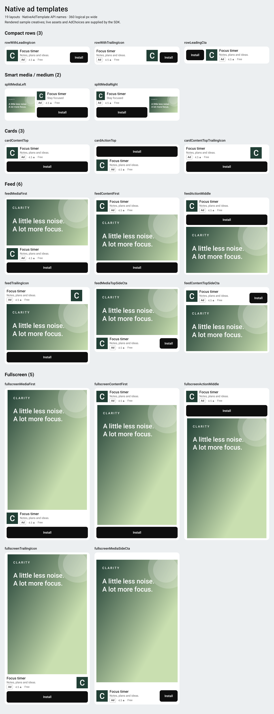

# Native ads

Declare a `NativePlacement` and mount `AdNativeView`.
The package registers the supplied templates. App integration needs no Android XML or iOS XIB factory.

## Select a template

All 19 templates are available on Android and iOS.
Names describe asset order, not the text supplied by an advertiser.

| Family | Templates | Initial loading estimate |
| --- | --- | --- |
| Compact row | `rowWithLeadingIcon`, `rowWithTrailingIcon`, `rowLeadingCta` | 80 logical pixels |
| Smart media | `splitMediaLeft`, `splitMediaRight` | 160 |
| Card | `cardContentTop`, `cardActionTop`, `cardContentTopTrailingIcon` | 132 |
| Feed | `feedMediaFirst`, `feedContentFirst`, `feedActionMiddle`, `feedTrailingIcon` | 340 |
| Feed with side CTA | `feedMediaTopSideCta`, `feedContentTopSideCta` | 280 |
| Fullscreen | `fullscreenMediaFirst`, `fullscreenContentFirst`, `fullscreenActionMiddle`, `fullscreenTrailingIcon`, `fullscreenMediaSideCta` | Bounded host, at least 320 high |

Presets are `compactRow` = `rowWithLeadingIcon`, `smartMedia` = `splitMediaLeft`,
`stackedCard` = `cardContentTop`, `feedCard` = `feedMediaFirst`, and `fullscreen` = `fullscreenMediaFirst`.



The image uses sample creatives at 360 logical pixels wide. Live SDK assets and platform text metrics can differ.

- Row templates keep CTA beside identity. Supplied video appears above that row.
- Smart media keeps a 120-pixel-wide media view beside copy, metadata, and the column-width CTA.
- Cards use a separate full-width CTA. Supplied video follows identity; `cardActionTop` places CTA first.
- Feed templates place media, identity, and CTA in the order named.
- Fullscreen templates fill bounded height. They do not provide app navigation controls.

Supplied icons and video remain visible. Missing optional assets collapse.
Incomplete creatives can make two templates look similar. Do not add empty rows to distinguish them.
The app cannot replace template structure through Flutter child widgets.

## Layout bounds

Provide bounded width of at least 320 logical pixels.
Inline ads measure their actual assets at the available width and Flutter text scale.
`template.height` is an initial estimate, not a fixed height.
Use content-sized list items, not a fixed-height container based on that estimate.
Smart media is normally shorter than feed media, but longer metadata or CTA text can increase its height.

Fullscreen templates require bounded height of at least 320 and sufficient room for copy and media.
Keep the dismiss control outside ad assets. Do not place a fullscreen host directly in an unbounded scrolling axis.
Use `active` for retained pages. Only loaded, measured, active fullscreen content holds presentation ownership.
Native media preserves aspect ratio. Letterboxing can be visible; do not crop or stretch the creative to remove it.

`NativeAdTemplate` exposes `height`, `minWidth`, `isFullscreen`, and `factoryId` as template metadata.
`factoryId` identifies the supplied composition. It is not a custom-template registration API.

## Colors and CTA radius

Declare initial styles with `AdmobKitConfig.nativeStyle` or `NativePlacement.style`.
Use unsigned ARGB values, including the alpha channel.

```dart
const blueNative = NativePlacement(
  id: 'blue_native',
  androidId: AdMobTestIds.nativeAndroid,
  iosId: AdMobTestIds.nativeIos,
  template: NativeAdTemplate.smartMedia,
  style: NativeAdStyle(
    background: 0xffffffff,
    headline: 0xff111111,
    body: 0xff555555,
    callToActionBackground: 0xff2563eb,
    callToActionText: 0xffffffff,
    callToActionCornerRadius: 8,
  ),
);
```

The live override replaces its scope. It does not merge with the previous override.
Null values inherit from the next scope. Body color also applies to metadata.
A radius of zero is square. A large radius clamps to half the CTA height.
Radius does not change the button size or click region.

```dart
Future<void> useDarkNativeTheme() => AdmobKit.setNativeStyle(
  const NativeAdStyle(
    background: 0xff101010,
    headline: 0xfff5f5f5,
    body: 0xffbbbbbb,
    callToActionBackground: 0xfff5f5f5,
    callToActionText: 0xff101010,
    callToActionCornerRadius: 100,
  ),
);

Future<void> resetNativePlacement(NativePlacement placement) =>
    AdmobKit.setNativeStyle(const NativeAdStyle(), placement: placement);
```

Await updates and handle platform errors. Updates apply to pending, cached, and displayed ads without reloading.
An empty placement override restores inheritance from the global/native style.
It does not restore that placement's original constructor style.

## Production limit

The current templates use one-line headline and body text with native end ellipsis.
This can truncate protected copy at narrow widths or larger text scales.
Passing layout tests does not establish policy compliance.

AdMob requires at least 25 headline characters and 90 body characters before truncation.
Body display is optional, but displayed body copy still has that limit.
The attribution badge and SDK AdChoices must remain visible.
Fullscreen transition ads need an app-provided dismiss action outside ad assets.
See [Google's native ad policy](https://support.google.com/admob/answer/6329638).

This limitation is not fixed by color settings, smaller containers, or suppressing layout errors.
Do not release these native templates until the protected-copy issue is resolved and the actual integration is checked.
